# 02 · Features

> A complete list of what CampusWay can do, grouped by area. Each feature names the screen it lives on; see [03 · User guide](03-user-guide.md) for how to use it step by step.

**Contents:** [Campus map and route planning](#1-campus-map-and-route-planning) · [Search](#2-search) · [Accessibility profiles](#3-accessibility-profiles) · [Services near me](#4-services-near-me) · [Emergency shelter routing](#5-emergency-shelter-routing) · [Multi-building journeys](#6-multi-building-journeys) · [Indoor navigation](#7-indoor-navigation) · [Voice and audio](#8-voice-and-audio) · [Languages](#9-languages) · [Favourites, sharing and QR codes](#10-favourites-sharing-and-qr-codes) · [Live campus status and problem reports](#11-live-campus-status-and-problem-reports) · [Progressive Web App and offline use](#12-progressive-web-app-and-offline-use) · [Developer tools](#13-developer-tools)

---

## 1. Campus map and route planning

*Screen: campus map (`index.html`)*

| Feature | Description |
|---|---|
| Interactive campus map | Leaflet map of the University of Haifa limited to the campus area. It shows building outlines, building markers, gates, food places, shops, the clinic, outdoor elevators and outdoor stairs. Building names appear when zoomed in. |
| Map key | Collapsible legend. Its open or closed state is remembered on the device. |
| "Show whole campus" control | Re-fits the map to the full campus. |
| Start point | Default is Carmel Gate. The user can type a building or room, speak it, or use the device GPS. |
| Destination | A building, a room inside a mapped building, a food place, a shop, or a campus service. |
| Smart exit and entrance choice | For trips between buildings, every allowed exit of the start building is compared with every allowed entrance of the destination building. Each pair is scored by the indoor walk from the start room to the exit plus the outdoor route, and the fastest wins. |
| Animated route line | Dotted animated line from start to destination, snapped to the building markers. |
| Walking time (ETA) | Full-journey estimate in minutes. It includes the indoor legs, the outdoor leg, elevator waits and stairs. Mobility users are estimated at a slower outdoor walking speed. |
| Turn-by-turn directions | Outdoor directions such as *"Walk 100 m, then turn left near Rabin Building"*, with landmarks, stairs, and "passing X on your right" reassurance steps. |
| Building popups | Each building has *Navigate here*, *Save to Favourites*, *Share* and, for indoor-mapped buildings, *Report a problem*. |

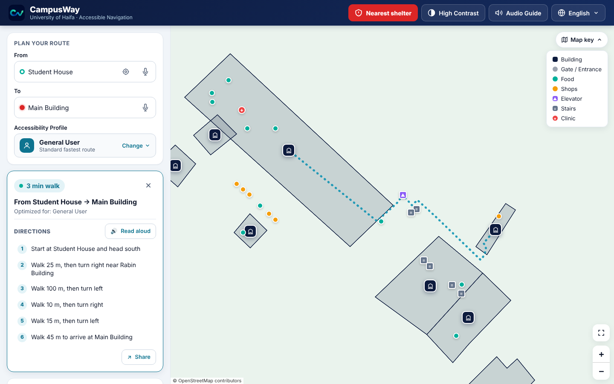

## 2. Search

*Screen: campus map. "From" and "To" fields*

| Feature | Description |
|---|---|
| Buildings | Matched by English and Hebrew names, plus aliases in English, Hebrew and Arabic (e.g. "Eshkol", "אשכול", "اشكول"). |
| Rooms and indoor places | Rooms, gyms, libraries, landmarks, the museum and parking, from all mapped buildings. Searching a room number shows the building and floor. |
| Kind words | Words like *elevator / lift / מעלית / مصعد* list the matching places, one result per building and label. |
| Service words | Words like *restroom, toilet, שירותים, حمام, shelter, ממ"ד, food, coffee, print, clinic, library, gym* offer a "Nearest …" suggestion near the start point. |
| Typo tolerance | Fuzzy matching allows 1 typo in words of 4 or more letters and 2 typos in words of 7 or more letters. Numbers have no typo tolerance and match as part of a room number ("500" lists 5001, 5002 …). |
| Script-aware matching | Ignores accents, Hebrew vowel marks (niqqud) and final letters, and Arabic diacritics and letter variants. |
| Helpful empty results | "No matching building or room found", or "This starting point is not mapped yet" for a known-format room number that is not mapped. |
| Keyboard and screen-reader support | Suggestion lists follow the ARIA combobox pattern and work with arrow keys, Enter and Escape. |

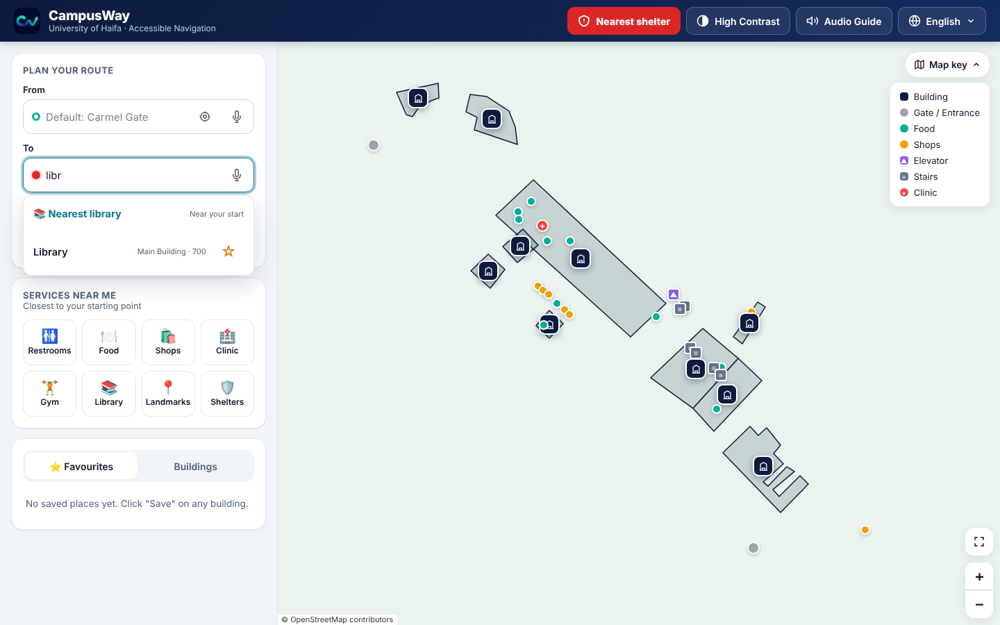

## 3. Accessibility profiles

*Screen: campus map. "Accessibility Profile" selector; the choice is kept for the session*

| Profile | What changes |
|---|---|
| **General User** | Standard fastest route. |
| **Mobility** (wheelchair / crutches) | Outdoor routes exclude steps. Entrances that need stairs are not used. Indoor routes use elevators only. The Rabin ↔ Terrace transfer always uses the shared elevator. Indoors, Manual / Wheelchair mode is selected and step-free routing is locked on. Outdoor walking time is estimated at 0.8 m/s instead of 1.2 m/s. If no step-free route is mapped, the app says so instead of drawing an unsafe line. |
| **Visual Impairment** | Turns the audio guide on, so actions and routes are spoken. Voice guidance is on by default in indoor navigation. |
| **Spatial / Navigation** | Prefers routes with fewer turns: each turn of 35° or more costs the same as 6 extra metres of walking. Applied both outdoors and indoors. |
| **Mental Health Support** | Turns the Landmarks button into **Rest Spaces**, moves it first in "Services near me", and immediately suggests the three nearest mapped rest spaces (terraces, gardens, landmarks, libraries), with travel times. |

## 4. Services near me

*Screen: campus map. "Services near me" grid; distances are measured from the start point*

| Button | Behaviour |
|---|---|
| Restrooms | Routes to the nearest building that has a mapped restroom. |
| Food | Highlights all food places on the map. A place's popup offers *Navigate here*. |
| Shops | Highlights all shops (including printing and the minimarket). |
| Clinic | Routes to the campus clinic. |
| Gym | Routes to the nearest mapped gym, continuing indoors to it. |
| Library | Routes to the nearest mapped library, continuing indoors to it. |
| Landmarks / Rest Spaces | Routes to the nearest mapped landmark; with the Mental Health profile, shows suggested rest spaces. |
| Shelters | Routes to the nearest building with a mapped shelter. The red **Nearest shelter** button (below) also guides you indoors to the shelter room. |

Tapping an active button again cancels it.

| Food places highlighted | Rest-space suggestions |
|---|---|
| 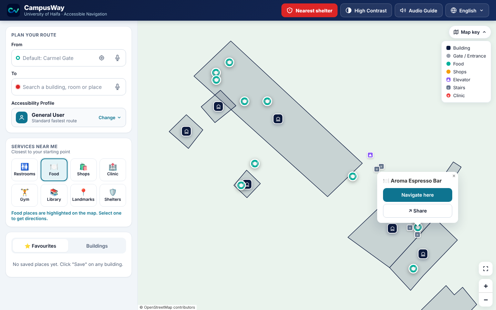 | 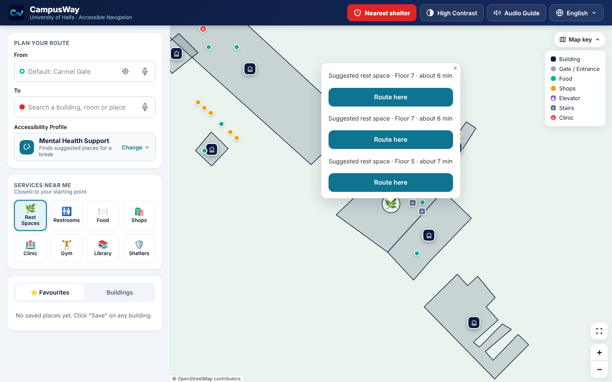 |

## 5. Emergency shelter routing

*Screens: campus map and indoor navigation. Red "Nearest shelter" button*

- One tap finds the fastest reachable shelter. It compares real outdoor routes plus indoor walking time for every mapped shelter.
- A shelter the app can guide you to indoors is preferred, unless another shelter is at least 60 seconds closer.
- Uses the chosen start point, or the device location (4-second timeout), or Carmel Gate as a fallback.
- The route card turns red and is marked 🛡️. *Continue indoors* leads to the shelter room on the floor plan.
- The indoor page has its own shelter button. If the current building has no mapped shelter, it returns to the campus map in emergency mode.
- Can be opened directly with the link parameter `?emergency=1`.

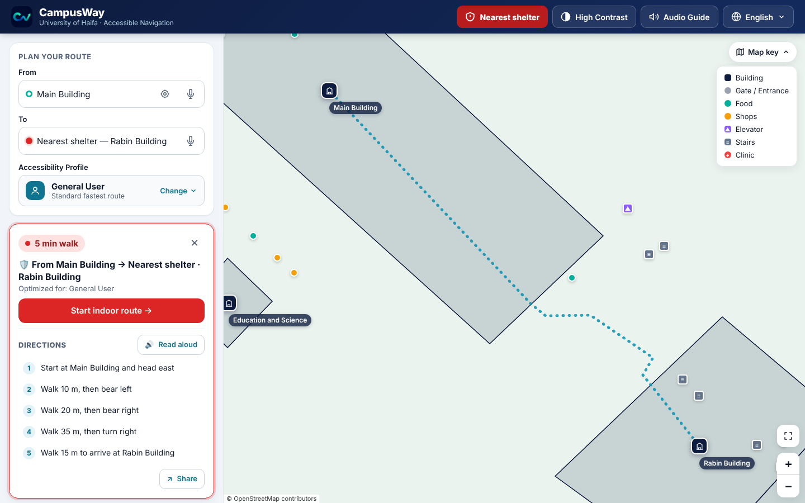

## 6. Multi-building journeys

*Screens: campus map and indoor navigation*

| Feature | Description |
|---|---|
| Room-to-room routing | Start in a room in one building and end in a room in another. The journey is split into an indoor origin leg, an outdoor leg, and an indoor destination leg. |
| Automatic hand-off | Reaching the exit of the origin building (in Auto or Manual mode) automatically returns to the campus map with the outdoor leg drawn and a *Continue indoors* button ready. |
| Same-building routing | If start and destination are in the same building, the app goes straight to indoor navigation. |
| Rabin ↔ Terrace shared transfer | These buildings connect directly: by stairs (Rabin floor 5 ↔ Terrace floor 4), or by the shared elevator for step-free routes. No outdoor leg is needed. |
| Main ↔ Terrace chain | Main floor 600 → bridge → Rabin → shared connection (elevator for step-free routes, otherwise stairs) → Terrace. |
| Shared-elevator continuity | A pending elevator ride is kept when the app switches from one building's floor plan to the next, so the user only confirms "I exited on Floor X". |
| Journey resume | If the page is reloaded mid-journey, the outdoor leg is rebuilt from the saved journey state. |

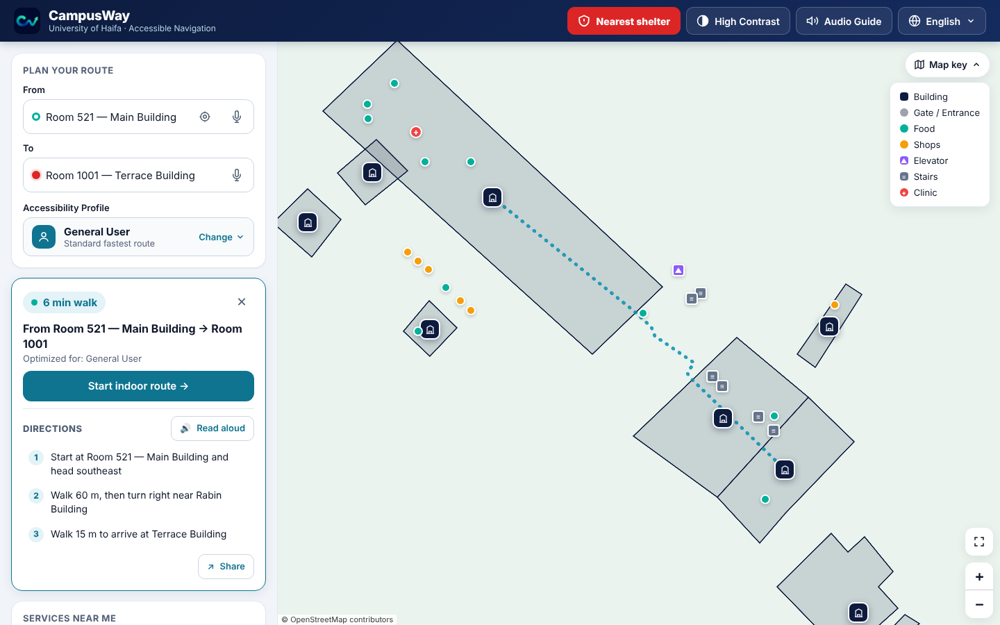

## 7. Indoor navigation

*Screen: indoor navigation (`wayframe/navigation-demo.html`)*

| Feature | Description |
|---|---|
| Schematic view | Default view: the route over a light outline of the corridor network, which is easy to read on a phone. |
| Floor-plan view | "Show floor plan" overlays the architectural drawing of the floor. |
| Floor selector | Lists the floors the route passes through. Floor changes are marked on the map, e.g. "⇅ Elevator · Floor 2" or "↗ Stairs · Floor 5". |
| Zoom and pan | Buttons, mouse wheel, drag, and a *Recenter* button. |
| Step list | Numbered indoor instructions such as *"Walk 10 m, then turn right near Stairs"* and *"Take the elevator down to Floor 2"*, with nearby rooms as landmarks. Tap a step to hear it. |
| Navigation banner | Large turn arrow with the current instruction and destination. |
| **Auto mode** | Animated preview of the whole route, pausing at floor changes. |
| **Phone Sensors mode** | The marker moves along the planned route as the phone detects steps. The map rotates heading-up. The user confirms stairs and elevator floor changes. |
| **Manual / Wheelchair mode** | No sensors. The route is split into checkpoints (turns, elevator entry and exit), and the user taps *I reached the next point*. *Previous point* goes back. |
| Arrival dialog | "You have arrived!" with *Done*, *New route from here*, and *Back to campus map*. |
| Share and report | Share a link to the destination room, or report an elevator or restroom problem. |

| Route on the floor plan | Manual / Wheelchair mode |
|---|---|
| 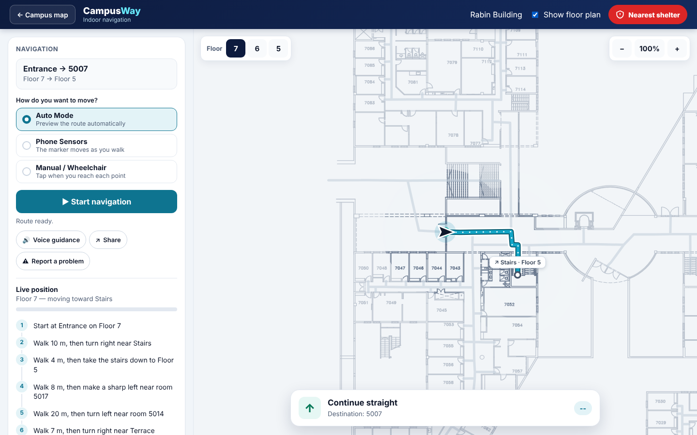 |  |

## 8. Voice and audio

| Feature | Where | Description |
|---|---|---|
| Audio guide | Campus map | Speaks confirmations, route summaries and directions. |
| Read directions aloud | Campus map | Reads the turn-by-turn list and highlights the step being read. Tap a single step to hear only that step. |
| Voice guidance | Indoor navigation | Speaks each new instruction automatically. |
| Voice search | Campus map | Microphone buttons on *From* and *To* use speech recognition in the current language, with a live voice-level indicator. |

## 9. Languages

- Full interface in **English, Hebrew and Arabic**, chosen on the first screen and switchable from the top bar at any time.
- Right-to-left layout for Hebrew and Arabic, including arrows, dialogs and map popups.
- Directions, indoor instructions, floor names and spoken guidance follow the chosen language.

| Hebrew | Arabic |
|---|---|
| 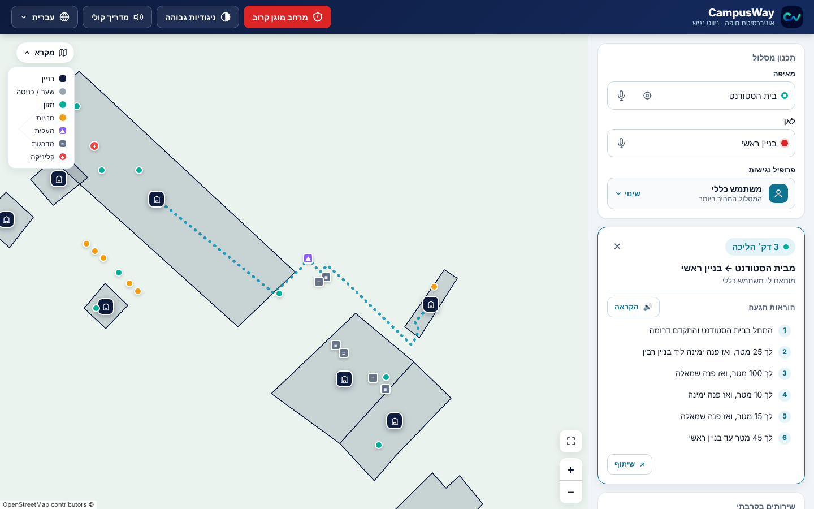 | 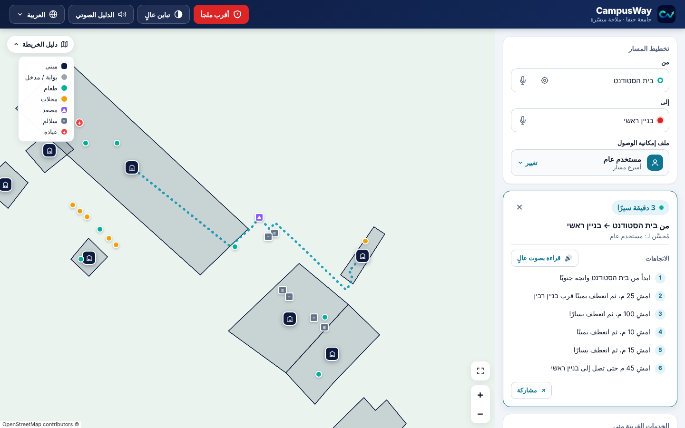 |

## 10. Favourites, sharing and QR codes

| Feature | Description |
|---|---|
| Favourites | Save buildings from their popup, and rooms with the ☆ in search results. The *Favourites* tab lists them for one-tap routing. They are stored on the device. |
| Buildings list | The *Buildings* tab lists every campus building. |
| Share a route or place | Creates a link that opens CampusWay with the same start and destination. |
| QR code | The share dialog shows a QR code, generated offline by the app's own encoder, that can be downloaded as a PNG. Uses the phone's native share sheet when available, or *Copy link*. |

| Favourites | Share dialog with QR code |
|---|---|
| 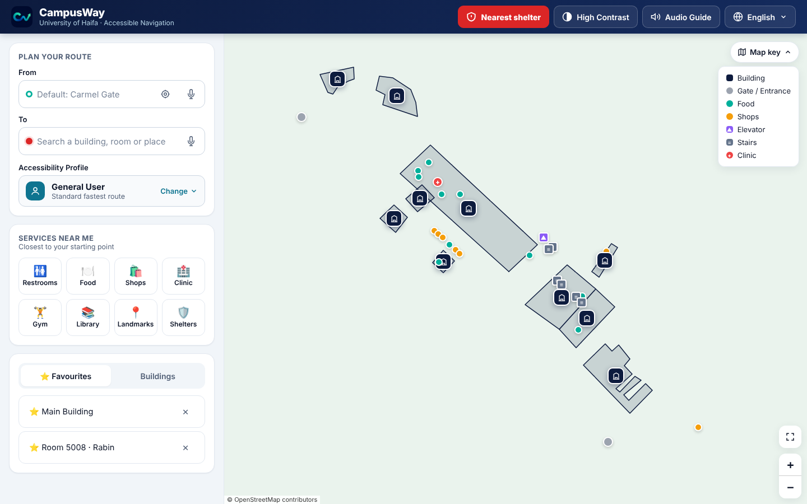 | 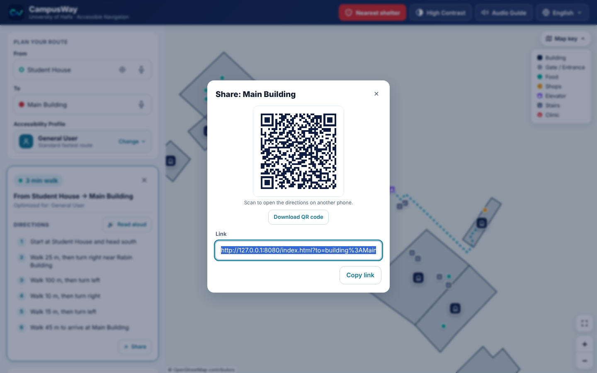 |

## 11. Live campus status and problem reports

| Feature | Description |
|---|---|
| Official status file | `app/data/campus-status.json` can list elevator outages, closed indoor areas, outdoor no-go zones, opening hours and a contact e-mail. |
| Effect on routing | Outdoor routes avoid no-go zones and an out-of-service outdoor elevator. Indoor routes skip closed nodes and out-of-service elevators. |
| On-screen notices | No-go zones are drawn in red. The outdoor elevator icon shows ✕ when out of service. The route card warns about outages on the way. Popups show opening hours ("Open now · until 18:00"). |
| Report a problem | Users can report an elevator, a restroom or another problem. Reports are kept on the device for 14 days, and an elevator reported out of service is avoided for 24 hours. The thank-you screen offers e-mail (when a contact is configured) or copying the report. |

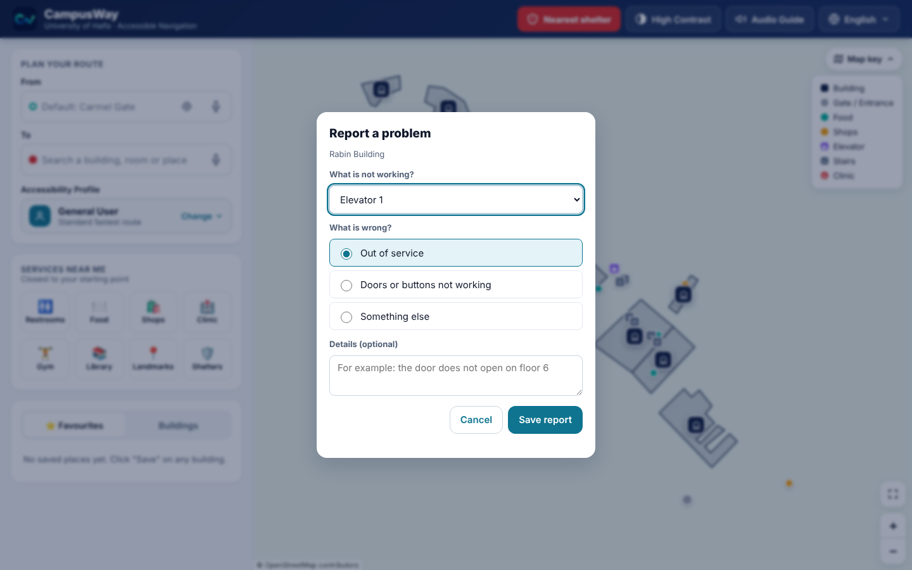

## 12. Progressive Web App and offline use

- Installable to the home screen (web app manifest, standalone display, app icon).
- A service worker pre-caches the app, every indoor graph and every floor plan, so search, routing, indoor navigation and QR codes work offline after the first visit.
- The live status file is fetched network-first, so it stays current when online.
- The base map tiles come from OpenStreetMap and need a connection; offline, the map shows the building outlines, markers and routes on a plain background.

## 13. Developer tools

| Tool | Purpose |
|---|---|
| **WayFrame node plotter** (`wayframe/wayframe.html`) | Visual editor used to draw the indoor graphs on top of floor plans, test routes, and export the JSON. |
| Route tester (`wayframe/route-tester.html`) | Read-only viewer that draws a route over the raw floor plan. |
| Sensor test (`wayframe/sensor-test.html`) | Live step-count and heading readout for tuning on real phones. |
| Audio test / Mic test | Check text-to-speech voices and microphone access on a device. |
| `?debug` | Shows coordinates when clicking the campus map. |

See [13 · Developer tools and indoor mapping](13-developer-tools-and-mapping.md).
