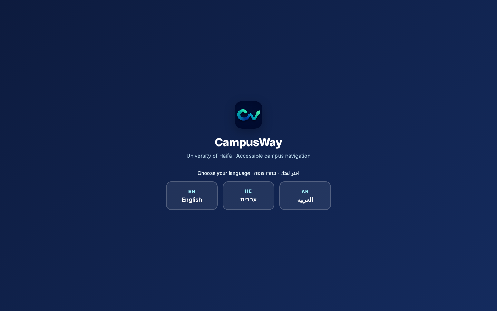
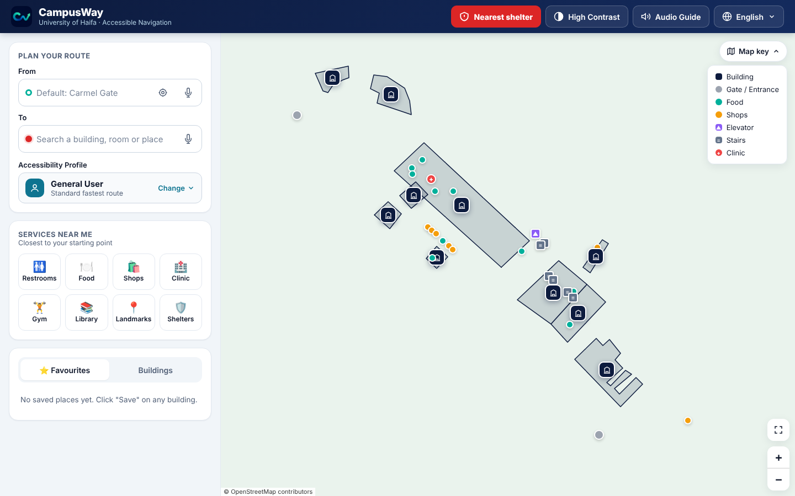
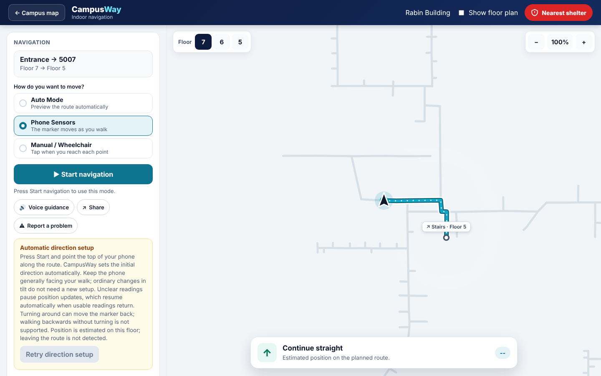
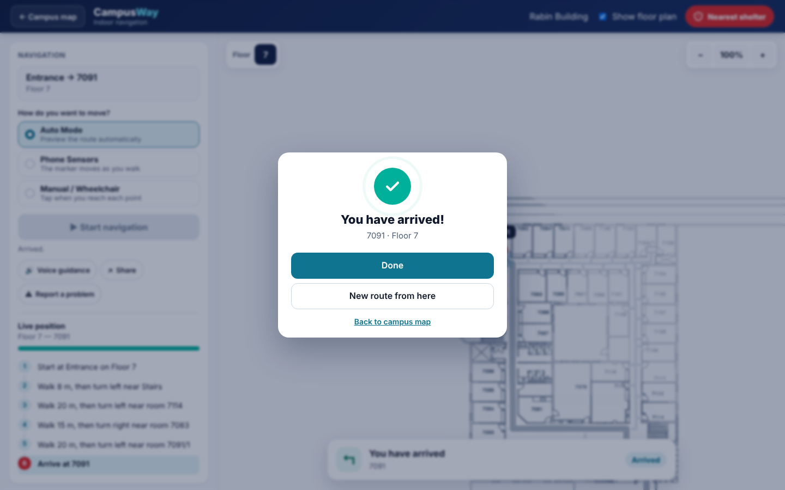

# 03 · User guide

> How to use CampusWay, step by step: from opening the app to arriving at a room. Written for students, visitors and testers. No technical knowledge is needed.

**Contents:** [Open the app](#1-open-the-app) · [Choose a language](#2-choose-a-language) · [The campus screen](#3-the-campus-screen) · [Plan a route](#4-plan-a-route) · [Choose an accessibility profile](#5-choose-an-accessibility-profile) · [Follow outdoor directions](#6-follow-outdoor-directions) · [Navigate indoors](#7-navigate-indoors) · [Find services near you](#8-find-services-near-you) · [Emergency: nearest shelter](#9-emergency-nearest-shelter) · [Favourites](#10-favourites) · [Share a route](#11-share-a-route) · [Report a problem](#12-report-a-problem) · [Display and sound settings](#13-display-and-sound-settings) · [Tips and troubleshooting](#14-tips-and-troubleshooting)

---

## 1. Open the app

- **On a phone or computer:** open <https://ja4smin.github.io/CampusWay/> in Chrome, Edge or Safari.
- **Install it (optional):** in the browser menu choose *Add to Home screen* (Android/Chrome) or *Share → Add to Home Screen* (iPhone/Safari). CampusWay then opens like an app and works offline after the first visit.

Phone-sensor navigation needs the secure **https://** address above. A local network address may not allow sensor access.

## 2. Choose a language

The first screen asks for a language: **English**, **עברית** or **العربية**. Hebrew and Arabic switch the whole layout to right-to-left.

You can change the language later with the globe button in the top bar.

## 3. The campus screen

| Area | What it is for |
|---|---|
| Top bar | **Nearest shelter** (red), **High Contrast**, **Audio Guide**, language menu |
| Plan your route | *From* and *To* fields and the *Accessibility Profile* selector |
| Services near me | Restrooms, Food, Shops, Clinic, Gym, Library, Landmarks, Shelters |
| Favourites / Buildings | Your saved places, and a list of all buildings |
| Map | Buildings (dark markers), gates, food (green), shops (orange), clinic (red +), elevators and stairs. Use **Map key** to see the legend. |

On a phone the map is at the top and the panels are below it; scroll down to see them.

## 4. Plan a route

1. **From** (optional). Leave it empty to start at Carmel Gate, or:
   - type a building or room number and pick a suggestion;
   - press the **target icon** to use your GPS position;
   - press the **microphone** and say the place.
2. **To.** Type a building, a room number (e.g. `5008`), a place (`Aroma`) or a service word (`library`, `toilet`), then pick a suggestion. You can also tap a building on the map and choose **Navigate here**.
3. The route appears on the map, and the **route card** shows the walking time, *From → To*, and the directions.

> **Tip:** Searching a room number shows its building and floor. If the same number exists in two buildings, both are listed.

To clear a route, press **✕** on the route card.

## 5. Choose an accessibility profile

Press **Change** under *Accessibility Profile* and choose:

| Profile | Choose it if you… |
|---|---|
| **General User** | want the standard fastest route |
| **Mobility** | use a wheelchair or crutches; stairs are avoided everywhere |
| **Visual Impairment** | want everything spoken aloud |
| **Spatial / Navigation** | prefer routes with fewer turns |
| **Mental Health Support** | want suggestions for quiet places to take a break |

The current route is recalculated immediately. If no step-free route is mapped for the Mobility profile, CampusWay says so; it does not draw a route that might include stairs.

## 6. Follow outdoor directions

- The **Directions** list gives each turn with distances and nearby buildings.
- Press **Read aloud** to hear all steps, or tap one step to hear only that step.
- With the **Audio Guide** on, the route summary and steps are read automatically.

## 7. Navigate indoors

When your start or destination is a room, the route card shows a button:

- **Start indoor route →** when you start inside a building (it guides you to the best exit);
- **Continue indoors →** when you reach the destination building.

### 7.1 The indoor screen

| Element | What it does |
|---|---|
| Route summary | *Entrance → 5007*, and the floors on the way (*Floor 7 → Floor 5*) |
| Mode choice | **Auto Mode**, **Phone Sensors**, **Manual / Wheelchair** |
| Start navigation | Starts the chosen mode |
| Floor buttons | Switch between the floors on your route |
| Show floor plan | Shows the architectural drawing under the route (off by default for a cleaner view) |
| Banner | The current instruction, e.g. *Turn left*, *Take the stairs to Floor 5* |
| Step list | All instructions; tap one to hear it |
| Voice guidance / Share / Report a problem | Tool buttons |
| ← Campus map | Back to the campus screen |

### 7.2 Choose a mode

**Auto Mode (preview).** Press *Start navigation* and watch the marker move along the whole route. It pauses briefly at floor changes. Use it to preview a route before you go.

**Phone Sensors.** The marker moves as you walk.

1. Hold the phone upright in portrait, pointing along the route (the direction of the first segment).
2. Press **Start navigation** and allow motion and orientation access if asked (iPhone shows a permission prompt).
3. Walk normally. The map turns with you, and each detected step moves the marker about 0.65 m along the route.
4. At stairs or an elevator, follow the banner and confirm with the button: *I entered the elevator*, then *I exited on Floor X*; or *I'm on Floor X* for stairs.
5. If you see *Direction unclear*, hold the phone steady and upright; tracking resumes on its own. If asked, point along the route and press Start again.

> Phone Sensors mode estimates your position along the planned route. It cannot tell if you leave the route, so check room signs.

**Manual / Wheelchair.** No sensors are used. The route is split into checkpoints at turns and elevators.

1. Press **Start navigation**.
2. Follow the banner, e.g. *Turn left and follow the highlighted route, about 9 m to the next turn*.
3. When you reach the shown point, press **✓ I reached the next point**. Use **← Previous point** to go back.
4. At an elevator, press **✓ Reached Floor X** when you exit.

This mode is selected automatically for the Mobility profile, and it always uses a step-free route.

### 7.3 Arriving

At the destination, **You have arrived!** appears. Choose **Done** or **Back to campus map**.

If this indoor leg was only the first part of a longer journey (you started in a room), CampusWay automatically returns to the campus map with the outdoor leg drawn (in Auto and Manual modes; in Phone Sensors mode, go back with **← Campus map**). Press **Continue indoors** when you reach the next building.

## 8. Find services near you

Use the **Services near me** buttons. Distances are measured from your *From* point.

- **Restrooms, Clinic, Gym, Library, Landmarks, Shelters** plan a route straight away.
- **Food** and **Shops** highlight the places on the map. Tap one and choose **Navigate here**.
- Press an active button again to cancel it.
- With the **Mental Health Support** profile, **Rest Spaces** appears first and shows the nearest quiet places with travel times; choose **Route here**.

## 9. Emergency: nearest shelter

Press the red **Nearest shelter** button in the top bar. It is also on the indoor screen.

CampusWay uses your *From* point, or your location, and routes you to the fastest reachable protected space. The route card turns red. Press **Continue indoors** to be guided to the shelter room.

## 10. Favourites

- **Save a building:** tap it on the map → **⭐ Save to Favourites**.
- **Save a room:** tap the ☆ next to it in the search suggestions.
- **Use a favourite:** open the **Favourites** tab and tap it. Remove it with **✕**.

Favourites are stored on your device only.

## 11. Share a route

Press **Share** on the route card, in a building popup, or on the indoor screen. You can:

- show the **QR code** for someone to scan, or **Download QR code** as an image;
- **Copy link**, or use **Share…** to send it through your phone's apps.

Whoever opens the link sees the same destination and start point. A GPS start is not included; the recipient can set their own *From*.

## 12. Report a problem

In the popup of a mapped building, or on the indoor screen, press **Report a problem**. Choose what is not working (e.g. *Elevator 1*) and what is wrong (*Out of service*, *Doors or buttons not working*, *Something else*), and save.

An elevator reported out of service is avoided by your routes for 24 hours. Reports stay on your device; the thank-you screen lets you copy the report (and e-mail it, when a contact address is configured) so you can send it to the university.

## 13. Display and sound settings

| Button | Effect |
|---|---|
| **High Contrast** | Black and yellow theme with larger-contrast map symbols |
| **Audio Guide** | Speaks actions, routes and directions |
| **Voice guidance** (indoor) | Speaks each new indoor instruction |
| Language menu | English / עברית / العربية |

## 14. Tips and troubleshooting

| Problem | What to do |
|---|---|
| The language screen appears again | The language is remembered only for the current browser session (tab). Choose it again. |
| "No step-free route found" | No route without stairs is mapped between these points. Try a different start or destination entrance, or ask for assistance. |
| Phone Sensors does not start | Use the https:// address, allow motion access, hold the phone upright in portrait, and keep it steady for a moment. |
| The marker drifts | Step length is an estimate (about 0.65 m). Use Manual mode for exact checkpoint confirmation. |
| No map background | The street map needs internet. Buildings, routes and indoor plans still work offline. |
| Voice search says "not supported" | Speech recognition depends on the browser; Chrome and Edge support it best. |
| No spoken guidance | Turn up the volume, and check that your device has a voice installed for the chosen language. |
