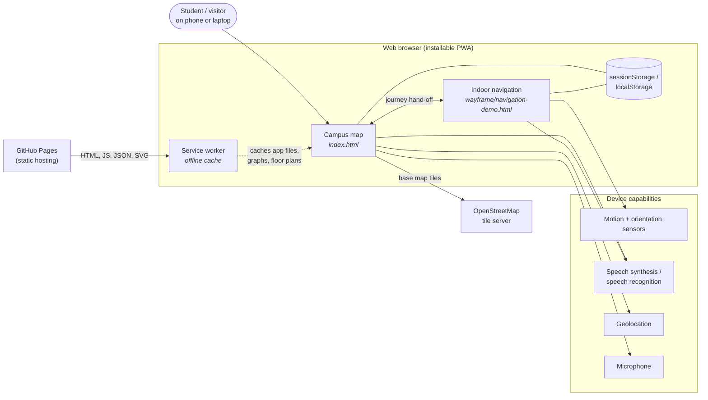
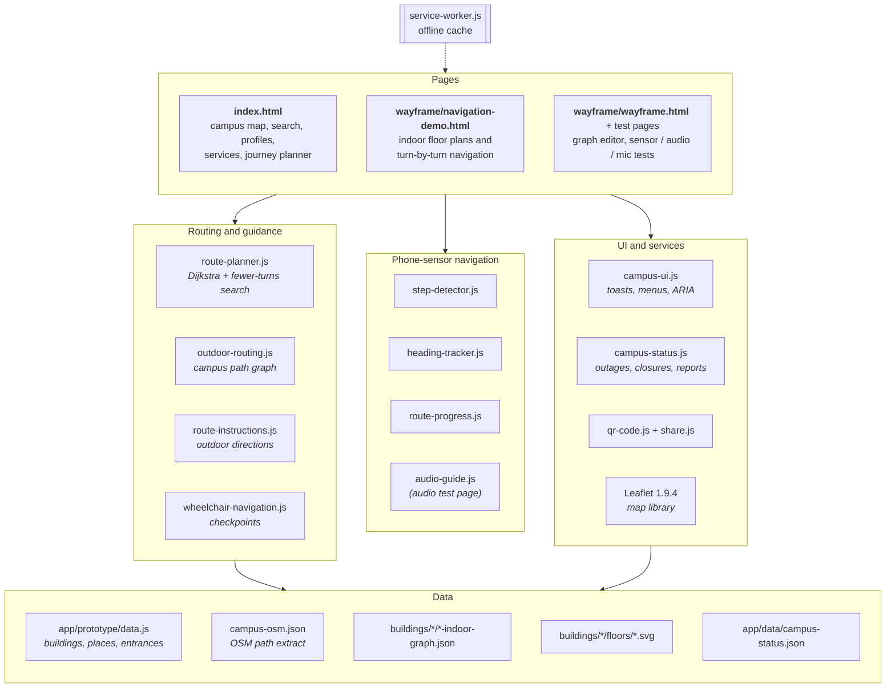
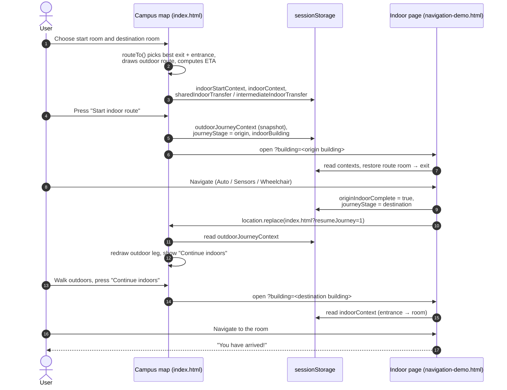
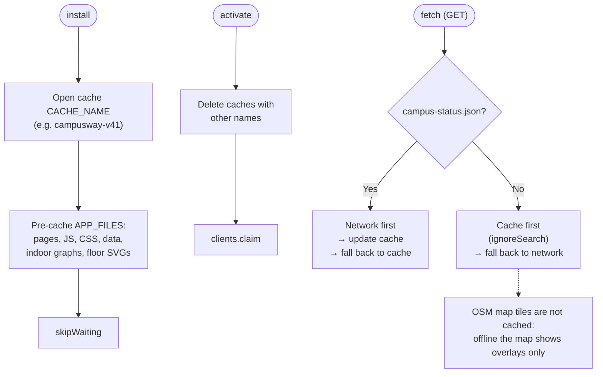

# 05 · Architecture

> How CampusWay is built: the system context, the two main pages and the modules they share, the project file structure, how a journey is handed between pages, where state is stored, and how the app works offline.

**Contents:** [Architectural style](#1-architectural-style) · [System context](#2-system-context) · [Components](#3-components) · [File structure](#4-file-structure) · [Module responsibilities](#5-module-responsibilities) · [Page hand-off](#6-page-hand-off-between-the-campus-map-and-indoor-navigation) · [State and storage](#7-state-and-storage) · [Offline and PWA design](#8-offline-and-pwa-design) · [Design decisions](#9-design-decisions)

---

## 1. Architectural style

CampusWay is a **static, client-side Progressive Web App**:

- **No backend.** All routing, search and navigation run in the browser. The server only delivers files.
- **No build step and no framework.** Plain HTML, CSS and JavaScript. The algorithm modules work both in the browser (as globals) and in Node.js (with `require`, for tests); the outdoor router and the UI helpers are browser globals.
- **Data-driven maps.** Buildings, places, entrances, indoor graphs and floor plans are data files; the routing code is mostly generic, with a few building-pair special cases in `routeTo()`.
- **Two pages, one journey.** The campus map (`index.html`) plans the trip and handles outdoor guidance. The indoor navigator (`wayframe/navigation-demo.html`) handles indoor guidance. They pass the journey between them through `sessionStorage`.

## 2. System context



<sub>Diagram source: [`diagrams/01-system-context.mmd`](diagrams/01-system-context.mmd) · Image: [PNG](diagrams/01-system-context.png) · [SVG](diagrams/01-system-context.svg)</sub>

| External element | Role |
|---|---|
| GitHub Pages | Hosts the static files over HTTPS |
| OpenStreetMap tile server | Base-map images for the campus map (online only) |
| Device sensors | Accelerometer and orientation for Phone Sensors mode |
| Speech services | Built-in browser text-to-speech and speech recognition |
| Geolocation | GPS start point and nearest-shelter search |

## 3. Components



<sub>Diagram source: [`diagrams/02-components.mmd`](diagrams/02-components.mmd) · Image: [PNG](diagrams/02-components.png) · [SVG](diagrams/02-components.svg)</sub>

## 4. File structure

```text
CampusWay/
├── index.html                    Campus map, search, profiles, services, journey planner (main page)
├── manifest.json                 PWA manifest (name, icons, colours, standalone display)
├── service-worker.js             Offline cache (CACHE_NAME, APP_FILES)
├── README.md                     Project front page
├── CHANGELOG.md                  Development history
├── CONTRIBUTING.md               Team workflow and checklist
├── app/
│   ├── data/
│   │   └── campus-status.json    Official status: elevator outages, closures, opening hours
│   ├── prototype/
│   │   ├── data.js               Buildings, places, entrances (CAMPUS_DATA, BUILDING_ENTRANCES)
│   │   ├── campus-osm.json       OpenStreetMap footpath extract (Overpass)
│   │   ├── outdoor-routing.js    Outdoor graph, campus corrections, routing API
│   │   ├── route-instructions.js Outdoor turn-by-turn directions (EN/HE/AR)
│   │   ├── madriga-graph.js      Terrace indoor graph as a JS global (used by search)
│   │   ├── multi-purpose-graph.js Multi-Purpose indoor graph as a JS global (used by search)
│   │   └── indoor.js             Early Terrace-only indoor router (prototype; not called)
│   ├── ui/
│   │   ├── campusway.css         Design tokens (colours, radii, shadows, fonts)
│   │   ├── campus-map.css        Campus map layout and components
│   │   ├── indoor-nav.css        Indoor navigation layout and components
│   │   ├── campus-ui.js          Toasts, language menu, profile picker, tabs, ARIA combobox
│   │   ├── campus-status.js      Live status, opening hours, problem-report dialog
│   │   ├── qr-code.js            QR code encoder (offline, no library)
│   │   └── share.js              Share dialog (QR, PNG download, copy, native share)
│   └── vendor/
│       ├── leaflet.js / .css     Leaflet 1.9.4 map library
│       └── images/               Leaflet marker images and the CampusWay icon
├── buildings/
│   └── <building>/               main, rabin, madriga, student, multi-purpose, education
│       ├── <building>-indoor-graph.json   Indoor graph (nodes + connections per floor)
│       └── floors/*.svg                   Floor-plan drawings
├── wayframe/
│   ├── navigation-demo.html      Indoor navigation page
│   ├── route-planner.js          Dijkstra and fewer-turns path search (shared indoor/outdoor)
│   ├── step-detector.js          Step detection from the accelerometer
│   ├── heading-tracker.js        Heading calibration and step-direction classification
│   ├── route-progress.js         Moving a position along the route polyline
│   ├── wheelchair-navigation.js  Checkpoint generation for Manual / Wheelchair mode
│   ├── audio-guide.js            Speech-synthesis helper (used by the audio test page)
│   ├── wayframe.html             WayFrame node plotter (indoor graph editor)
│   ├── route-tester.html         Route viewer for published graphs
│   ├── sensor-test.html          Step and heading field test
│   ├── audio-test.html           Text-to-speech voice test
│   ├── mic-test.html             Microphone access test
│   └── floors/                   Older copy of the Terrace floor plans (not referenced)
├── tests/                        Automated tests (node:test), 13 files, 171 tests
├── docs/                         This documentation
└── Claude outputs/
    └── start-campusway.bat       Windows helper that starts a local server and opens the app
```

## 5. Module responsibilities

### Pages

| Page | Responsibilities |
|---|---|
| `index.html` | Language selection, translations (`T` tables), Leaflet map and markers, search (start and destination), voice input, accessibility profiles, services near me, rest-space ranking, nearest shelter, the journey orchestrator `routeTo()` (exit/entrance choice, ETA, transfers), route card and directions, sharing, favourites, live-status integration, and the journey hand-off to the indoor page. |
| `wayframe/navigation-demo.html` | Loads the building's indoor graph and floor plans, builds the routing graph (with step-free and live-status filters), plans the indoor route, draws the SVG map (schematic or floor plan, overlays, user marker), generates indoor instructions, runs the three navigation modes, handles floor changes and shared-elevator rides, the arrival dialog, and the hand-off back to the campus map. |

### Shared modules

| Module | Global / export | Responsibility | Used by |
|---|---|---|---|
| `wayframe/route-planner.js` | `CampusRoutePlanner` | Generic shortest path (Dijkstra) and fewer-turns path search; rest-space detection | both pages, outdoor routing |
| `app/prototype/outdoor-routing.js` | `CampusOutdoorRouting` | Loads the OSM extract, applies campus corrections, snaps points, applies restrictions, returns routes | `index.html` |
| `app/prototype/route-instructions.js` | `CampusRouteInstructions` | Turns an outdoor polyline into worded steps | `index.html` |
| `app/prototype/data.js` | `CAMPUS_DATA`, `BUILDING_ENTRANCES`, `PLACE_NAMES_HE` | Campus data | `index.html` |
| `app/ui/campus-status.js` | `CampusStatus` | Loads the status file, evaluates outages, closures and hours, report dialog | both pages |
| `app/ui/campus-ui.js` | `CampusUI` | Presentation helpers for the campus page | `index.html` |
| `app/ui/qr-code.js`, `share.js` | `CampusQR`, `CampusShare` | QR encoding and the share dialog | both pages |
| `wayframe/step-detector.js` | `CampusStepDetector` | Step detection | indoor page, sensor test |
| `wayframe/heading-tracker.js` | `CampusHeadingTracker` | Heading calibration and step direction | indoor page, sensor test |
| `wayframe/route-progress.js` | `CampusRouteProgress` | 1-D movement along the route | indoor page |
| `wayframe/wheelchair-navigation.js` | `CampusWheelchairNavigation` | Checkpoints for manual navigation | indoor page |

## 6. Page hand-off between the campus map and indoor navigation

The two pages never call each other directly. The campus map writes the journey into `sessionStorage` and opens `wayframe/navigation-demo.html?building=<key>`. The indoor page writes the result back and returns to `index.html?resumeJourney=1`.



<sub>Diagram source: [`diagrams/03-page-handoff-sequence.mmd`](diagrams/03-page-handoff-sequence.mmd) · Image: [PNG](diagrams/03-page-handoff-sequence.png) · [SVG](diagrams/03-page-handoff-sequence.svg)</sub>

The **journey stage** (`journeyStage`) tells the indoor page which part of the trip it is guiding:

| Stage | Meaning | Indoor route |
|---|---|---|
| `origin` | The user starts inside a building | start room → best exit |
| `destination` | The user arrives at the destination building | entrance → destination room |
| `same-building` | Start and destination are in the same building | start room → destination room |
| `intermediate` | Passing through Rabin between Main and Terrace, or when leaving Terrace through Rabin | Rabin entrance → shared connection, or shared connection → Rabin exit |

See [06 · User flows](06-user-flows.md#3-multi-building-journey-stages) for the full state diagram.

## 7. State and storage

| Kind | Where | Lifetime | Examples |
|---|---|---|---|
| Session preferences | `sessionStorage` | Until the tab is closed | `campuswayLanguage`, `accessibilityProfile` |
| Journey state | `sessionStorage` | Until the journey ends or a new one starts | `indoorContext`, `indoorStartContext`, `journeyStage`, `outdoorJourneyContext`, `sharedIndoorTransfer`, `campusway.pendingSharedElevatorRide` |
| Personal data | `localStorage` | Until cleared | `campusway.favourites.v1`, `campuswayReports` (14 days) |
| UI preferences | `localStorage` | Until cleared | `campusway.legendOpen`, `campuswayIndoorVoice` (`campusway.audioEnabled` is written but not yet restored by the campus map) |
| Cached data | `localStorage` + Cache Storage | Until updated | `campuswayStatusCache`; service-worker cache `campusway-vNN` |
| Shareable state | URL parameters | – | `?from=…&to=…`, `?emergency=1`, `?building=…&from=…&to=…` |

The full list of keys and parameters is in [08 · Data model](08-data-model.md#6-browser-storage-keys).

## 8. Offline and PWA design



<sub>Diagram source: [`diagrams/11-service-worker.mmd`](diagrams/11-service-worker.mmd) · Image: [PNG](diagrams/11-service-worker.png) · [SVG](diagrams/11-service-worker.svg)</sub>

- `manifest.json` makes the app installable (standalone display, theme colour `#0D1B3E`).
- On install, the service worker pre-caches everything in `APP_FILES`: pages, scripts, styles, data, every indoor graph and every floor-plan SVG.
- Requests are served **cache-first**, so the app starts instantly and works offline. The status file is **network-first**, so it stays current.
- A new release is shipped by changing `CACHE_NAME` (e.g. `campusway-v41` → `campusway-v42`). The new worker replaces the old cache and takes control at once.
- Map tiles are not cached; offline, the map shows only the vector overlays.

## 9. Design decisions

| Decision | Reason |
|---|---|
| Static PWA, no backend | Free hosting, nothing to operate, works offline, and no personal data leaves the device. |
| Vanilla JavaScript, no framework or bundler | Simple for a student team to read and deploy; no toolchain to maintain. |
| Algorithm modules wrapped as UMD | The same file runs in the browser and in Node tests (route planner, progress, wheelchair checkpoints, instructions, QR, step and heading detection). |
| Graph-based indoor model (nodes and connections) over floor plans | Easy to draw with the WayFrame tool and to route on; floor plans are only a background. |
| Normalised (0–1) indoor coordinates | Graphs stay independent of each SVG's size and resolution. |
| OpenStreetMap extract stored locally, plus a correction layer | Routing works offline, and the team can fix campus paths missing from OSM. |
| `sessionStorage` hand-off between pages | Keeps both pages independent while surviving reloads within the tab. |
| Honest failure for step-free routing | Showing no route is safer than an unverified one for wheelchair users. |
| Manual checkpoint mode next to sensor mode | Sensors are unreliable for wheelchairs and differ between phones; confirmation always works. |
