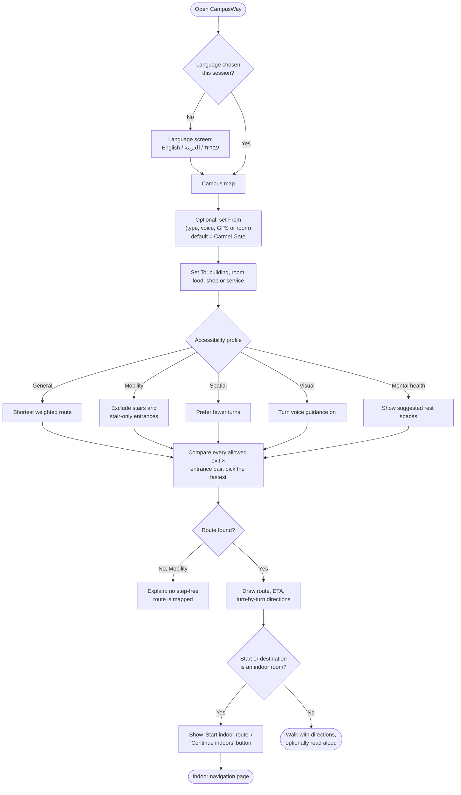
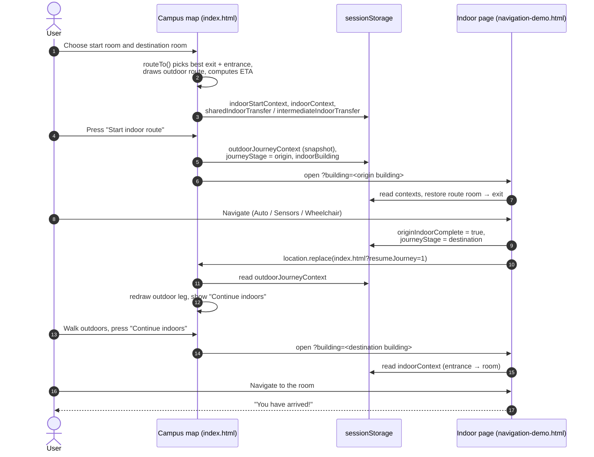
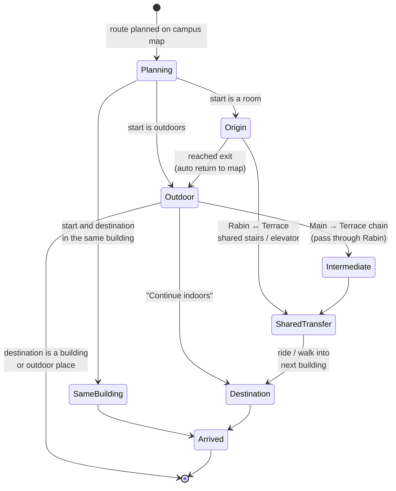
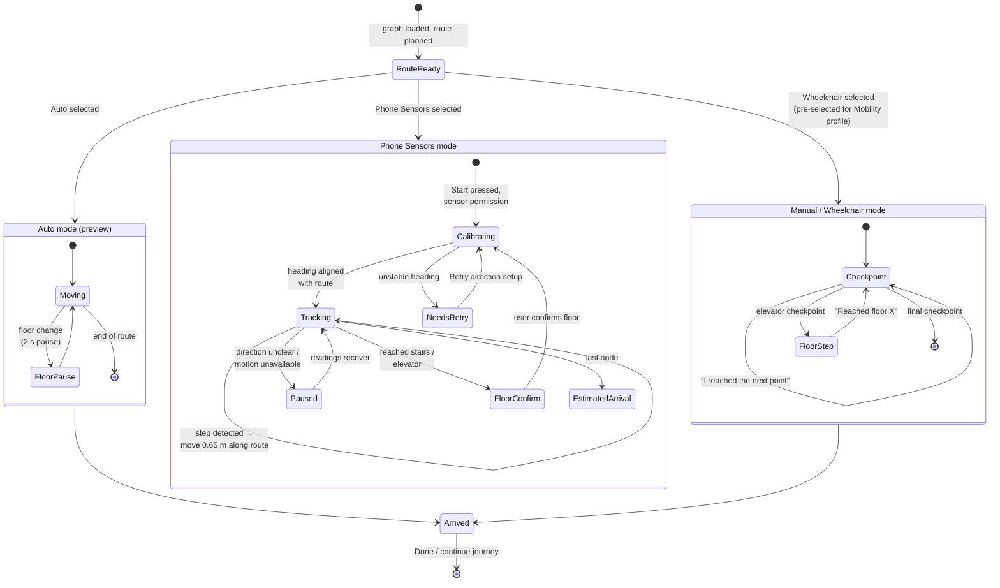
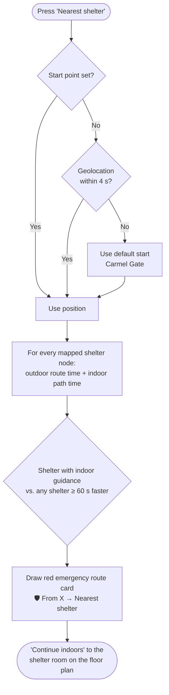

# 06 · User flows

> Diagrams of the main journeys through CampusWay: planning a route, multi-building trips, the hand-off between pages, the three indoor navigation modes, the shared-elevator crossing, the emergency shelter route, and returning to the campus map. Each diagram's editable source and image export are in [`diagrams/`](diagrams/README.md).

**Contents:** [Plan a route](#1-plan-a-route) · [Page hand-off](#2-hand-off-between-the-campus-map-and-indoor-navigation) · [Multi-building journey stages](#3-multi-building-journey-stages) · [Indoor navigation modes](#4-indoor-navigation-modes) · [Shared-elevator crossing](#5-shared-elevator-crossing-rabin--terrace) · [Nearest shelter](#6-nearest-shelter) · [Example journeys](#7-example-journeys)

---

## 1. Plan a route

From opening the app to a drawn route. The profile decides how the route is searched. The start and destination types decide whether indoor navigation is offered.

Diagram source: [`diagrams/04-plan-route-flow.mmd`](diagrams/04-plan-route-flow.mmd) · Image: [PNG](diagrams/04-plan-route-flow.png) · [SVG](diagrams/04-plan-route-flow.svg)

## 2. Hand-off between the campus map and indoor navigation

A full room-to-room journey crosses pages twice. Both pages store the journey in `sessionStorage`, so it survives reloads and the browser's back and forward buttons.

Diagram source: [`diagrams/03-page-handoff-sequence.mmd`](diagrams/03-page-handoff-sequence.mmd) · Image: [PNG](diagrams/03-page-handoff-sequence.png) · [SVG](diagrams/03-page-handoff-sequence.svg)

## 3. Multi-building journey stages

The value of `journeyStage` decides what the indoor page does when it opens and where it goes when the user arrives.

Diagram source: [`diagrams/05-journey-stages.mmd`](diagrams/05-journey-stages.mmd) · Image: [PNG](diagrams/05-journey-stages.png) · [SVG](diagrams/05-journey-stages.svg)

| From → To | Legs |
|---|---|
| Gate → building | outdoor |
| Gate → room | outdoor → indoor (*destination*) |
| Room → building | indoor (*origin*) → outdoor |
| Room → room, different buildings | indoor (*origin*) → outdoor → indoor (*destination*) |
| Room → room, same building | indoor (*same-building*) |
| Rabin ↔ Terrace | indoor → shared stairs or elevator → indoor (no outdoor leg) |
| Main → Terrace | Main indoor → bridge → Rabin (*intermediate*) → shared elevator → Terrace (*destination*) |

## 4. Indoor navigation modes

Diagram source: [`diagrams/06-indoor-navigation-modes.mmd`](diagrams/06-indoor-navigation-modes.mmd) · Image: [PNG](diagrams/06-indoor-navigation-modes.png) · [SVG](diagrams/06-indoor-navigation-modes.svg)

| | Auto | Phone Sensors | Manual / Wheelchair |
|---|---|---|---|
| Purpose | Preview or demonstration | Hands-free guidance while walking | Reliable guidance without sensors |
| What moves the marker | A timer | Detected steps, about 0.65 m each, in the detected direction | The user's confirmation at each checkpoint |
| Floor changes | Automatic, with a 2 s pause | User confirms (*I'm on Floor X*; elevator: *entered* then *exited*) | User confirms (*Reached Floor X*) |
| Map orientation | North-up | Heading-up (rotates with the phone) | North-up |
| Step-free route | Optional (locked on for Mobility) | Optional (locked on for Mobility) | Always |
| Arrival | Arrival dialog, or automatic hand-off to the next leg | "Estimated arrival — check the room sign" (no automatic hand-off) | Arrival dialog, or automatic hand-off to the next leg |

## 5. Shared-elevator crossing (Rabin ↔ Terrace)

Rabin floor 5 and Terrace floor 4 share an elevator and a stair connection. A step-free route between them uses the elevator:

1. The route in the first building ends at the shared elevator. The banner shows **Enter the shared elevator** with the button **✓ I entered the elevator**.
2. CampusWay saves the pending ride (`campusway.pendingSharedElevatorRide`) and opens the second building's floor plan.
3. The second page restores the ride and shows **Stay in the elevator until Floor X**, with **✓ I exited on Floor X**.
4. Navigation continues in the second building in the same mode.

On the way from Main Building to Terrace, the journey passes through Rabin: Main floor 600 → outdoor bridge → Rabin floor 7 entrance → Rabin floor 5 (the shared elevator for step-free routes, otherwise the stairs connection) → Terrace floor 4. Trips that leave Terrace through Rabin use the same *intermediate* stage in the other direction.

## 6. Nearest shelter

Diagram source: [`diagrams/10-nearest-shelter-flow.mmd`](diagrams/10-nearest-shelter-flow.mmd) · Image: [PNG](diagrams/10-nearest-shelter-flow.png) · [SVG](diagrams/10-nearest-shelter-flow.svg)

## 7. Example journeys

| Example | Start | Destination | What happens |
|---|---|---|---|
| Building to building | Student House | Main Building | About 3 minutes outdoors, 6 directions ([screenshot](images/screenshots/main-03-outdoor-route.png)) |
| Step-free | Student House (Mobility profile) | Rabin Building | Stairs avoided; slower walking speed in the ETA ([screenshot](images/screenshots/main-06-mobility-route.png)) |
| Room to room | Room 521, Main Building | Room 1001, Terrace Building | *Start indoor route* from room 521 to the Main floor 600 exit, outdoor bridge to Rabin, then on to Terrace ([screenshot](images/screenshots/main-07-room-to-room-journey.png)) |
| Indoor, multi-floor | Rabin entrance, floor 7 | Room 5007, floor 5 | Stairs down two floors; about 66 m ([screenshot](images/screenshots/indoor-02-route-floor-plan.png)) |
| Emergency | Main Building | Nearest shelter | Shelter in Rabin Building, about 5 minutes ([screenshot](images/screenshots/main-10-nearest-shelter.png)) |
