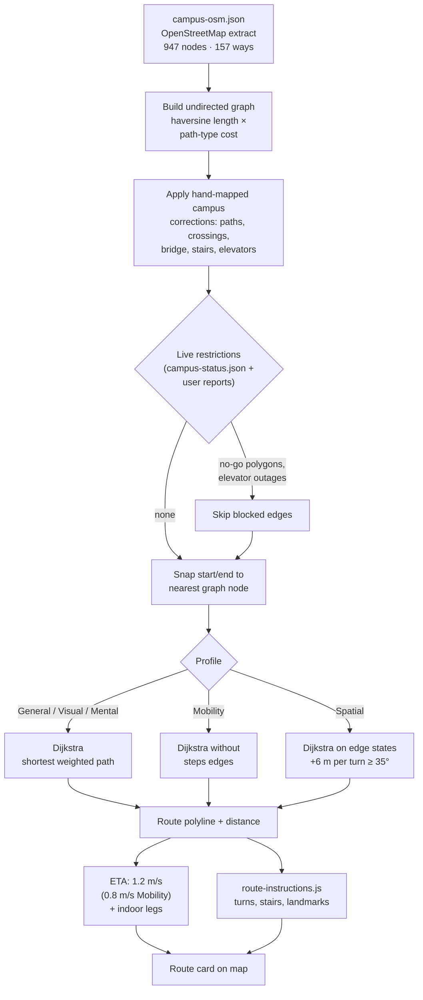
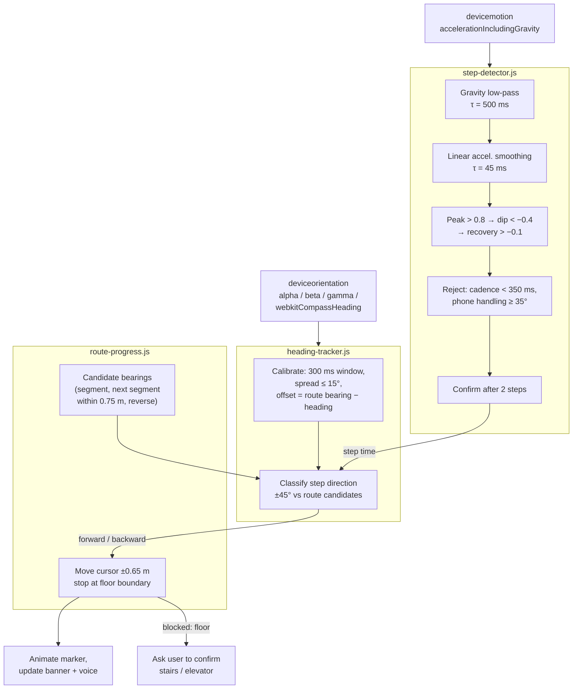

# 07 · Routing and navigation algorithms

> How CampusWay finds routes and guides people: the outdoor path graph, shortest-path and fewer-turns search, accessibility rules, how a multi-building journey is put together, ETA formulas, turn-instruction generation, and the phone-sensor pipeline (step detection, heading tracking, route progress) used for indoor navigation. All constants are quoted from the source.

**Contents:** [Path search (shared)](#1-path-search-shared-by-indoor-and-outdoor) · [Outdoor routing](#2-outdoor-routing) · [Indoor routing](#3-indoor-routing) · [Journey planning across buildings](#4-journey-planning-across-buildings) · [Estimated time of arrival](#5-estimated-time-of-arrival) · [Turn-by-turn instructions](#6-turn-by-turn-instructions) · [Phone-sensor navigation](#7-phone-sensor-navigation) · [Manual / Wheelchair checkpoints](#8-manual--wheelchair-checkpoints) · [Constants reference](#9-constants-reference)

---

## 1. Path search (shared by indoor and outdoor)

`wayframe/route-planner.js` (`CampusRoutePlanner.findPath`) is used for both outdoor and indoor graphs.

### 1.1 Shortest path: Dijkstra

- The graph is undirected and weighted; weights are in metres (outdoor weights are multiplied by a path-type cost).
- The standard Dijkstra algorithm picks the unvisited node with the smallest distance by a linear scan and stops as soon as the target is reached. This is O(V²), which is fast enough for about 1,000 outdoor and 750 indoor nodes per building.

### 1.2 Fewer-turns path (Spatial profile)

To prefer simpler routes, the search runs Dijkstra over **directed edge states** *(previous node, current node)* instead of plain nodes, so the cost of a turn can be known:

```
cost(path) = Σ edge length  +  6 m × (number of turns ≥ 35°)
```

- The turn angle is measured from the two segments' direction vectors in metre space. Floor changes never count as turns.
- Ties are broken by fewer turns, then shorter distance.
- If the cheapest path would visit a node twice (a loop taken to avoid a turn), the planner falls back to the plain shortest path.

Tests check that a slightly longer route with fewer turns wins, that excessive detours are still rejected, and that no loops are produced.

### 1.3 Rest spaces

`isSuggestedRestSpace(node)` treats as a rest space any node of type `landmark` or `library`, or any node whose label contains *garden* or *terrace*.

## 2. Outdoor routing



<sub>Diagram source: [`diagrams/08-outdoor-routing-pipeline.mmd`](diagrams/08-outdoor-routing-pipeline.mmd) · Image: [PNG](diagrams/08-outdoor-routing-pipeline.png) · [SVG](diagrams/08-outdoor-routing-pipeline.svg)</sub>

### 2.1 The path network

| Source | Content |
|---|---|
| `app/prototype/campus-osm.json` | OpenStreetMap extract from the Overpass API (base date 2026-09-21): 947 nodes and 157 `highway=*` ways (service, footway, path, residential, steps) |
| `applyCampusCorrections()` in `outdoor-routing.js` | Hand-mapped additions and fixes: about 117 extra nodes, 148 added and 8 removed edges. Covers campus paths, pedestrian crossings, building approaches, the Main–Rabin bridge, Rabin plaza stairs, shop and food access, gate paths, and two outdoor elevator links. |
| Result | 1,064 nodes and 1,089 undirected edges |

Each way is split into edges between consecutive nodes. An edge's length is computed with the haversine formula, and its routing weight is:

```
weight = length (m) × TYPE_COST[path type]
```

| Path type | Cost factor | Meaning |
|---|---|---|
| footway, pedestrian | 1.00 | preferred |
| path | 1.05 | |
| living_street | 1.20 | |
| steps | 1.30 | |
| service | 2.50 | service roads are avoided when possible |
| residential | 3.00 | |
| other, e.g. elevator links | 2.00 | |

### 2.2 Snapping and search

1. The start and end coordinates snap to the nearest graph node (haversine). With *avoid steps*, nodes reachable only by steps are skipped.
2. The path is searched with Dijkstra, or with the fewer-turns variant for the Spatial profile.
3. The result is the polyline `[start, …nodes, end]` with its distance and the list of edges, which is used for the instructions.

### 2.3 Restrictions

- **Mobility profile:** every `steps` edge is removed.
- **Live status:** an edge is blocked if its midpoint or an end point lies inside a no-go polygon (ray-casting point-in-polygon test). If the outdoor elevator is reported out of service, the elevator edges are blocked.
- **Entrances:** for the Mobility profile, entrances flagged `requiresStairs` or `avoidForMobility` are not used. Entrances flagged `onlyForService` (the Terrace floor −1 gym entrance) are never used as destination entrances; they can still be used as exits.

## 3. Indoor routing

### 3.1 Building the indoor graph

The indoor page builds a routing graph from `buildings/<key>/<key>-indoor-graph.json`:

- **Walking edges.** Each `connection` becomes an undirected edge. Its length in metres is computed from the normalised coordinates, see [3.3](#indoor-distances-and-eta).
- **Vertical edges.** Nodes of type `stairs` or `elevator` that share a `connectorId` are grouped. Each floor's node is linked to the same group's node on the next mapped floor in the building's floor order. Floor changes are given a very small weight (elevator 0.02, stairs 0.04), so routing is driven by walking distance.
- **Step-free routing** (the *Accessible route* option, the Mobility profile, or Manual / Wheelchair mode) removes every edge that touches a `stairs` node, and every stair link between floors.
- **Live status** removes closed nodes and elevators reported out of service.

### 3.2 Destination resolution

| Destination | How the target node is chosen |
|---|---|
| A room or node | That node |
| "Restroom" or "Shelter" | Every node of that type is a candidate; the lowest-cost path wins |
| A rest space | Every rest-space candidate; the lowest-cost path wins |
| Same-label rooms (e.g. a room with two doors) | The nearest one |
| "Elevators" on a floor | The corridor node nearest the centre of that floor's elevators |

### 3.3 Indoor distances and ETA <a id="indoor-distances-and-eta"></a>

Indoor coordinates are normalised (0–1) on the floor-plan image. They are converted to metres with one fixed scale for all buildings:

```
dx_m = Δx × 132.6      dy_m = Δy × 101.2      distance = √(dx_m² + dy_m²)
```

This is an approximation. Floor plans of different real sizes give proportionally wrong distances (see [14 · Limitations](14-limitations-and-future-work.md)).

## 4. Journey planning across buildings

`routeTo()` in `index.html` plans the whole journey:

1. **Collect candidate exits** of the start building and **candidate entrances** of the destination building from `BUILDING_ENTRANCES`, filtered by the profile.
2. **Score every exit × entrance pair**: indoor time from the start room to the exit plus the outdoor route time. When the start is outdoors, entrances are compared by outdoor time alone. The destination-side indoor walk is not part of the choice; it is added afterwards to the ETA that is shown.
3. **Choose the cheapest pair**, draw the outdoor route, and store the chosen exit and entrance for the indoor page.
4. **Special connections** replace the outdoor leg where buildings connect directly:
   - *Rabin ↔ Terrace*: stairs (Terrace floor 4 ↔ Rabin floor 5) or the shared elevator. The Mobility profile always uses the elevator. Otherwise, when the exact start and destination rooms are known, both options are compared by ETA; if not, the stairs connection is used.
   - *Main ↔ Terrace*: Main floor 600 exit → bridge → Rabin floor 7 → Rabin floor 5 (elevator for step-free trips, otherwise the stairs connection) → Terrace floor 4.
   - From Terrace to other buildings, leaving directly is compared with leaving through Rabin, and the cheaper option wins.
5. **Building-pair rules.** A few pairs use fixed exits or entrances hard-coded in `routeTo()`, e.g. Main → Eshkol / Welfare / Bloom / Arts uses Main's primary exit, Rabin → Main uses the floor 7 bridge exit, and Terrace → Main uses Main's floor 600 entrance.

## 5. Estimated time of arrival

| Component | Formula |
|---|---|
| Outdoor walking | distance ÷ 1.2 m/s (Mobility: 0.8 m/s) |
| Indoor walking | distance ÷ 1.2 m/s |
| Elevator ride | 30 s waiting + 10 s per floor |
| Stairs | 30 s per floor |
| Rabin ↔ Terrace shared transfer | 40 s (elevator) or 30 s (stairs) |
| Display | minutes, rounded, at least 1 ("3 min walk"); hours with one decimal above 60 minutes |

For the nearest-shelter search, an unreachable outdoor leg is estimated as straight-line distance × 1.3, and an unknown indoor leg adds 60 s.

## 6. Turn-by-turn instructions

### 6.1 Outdoor (`app/prototype/route-instructions.js`)

1. Project the polyline to metres (equirectangular projection around the campus latitude).
2. At each point, measure the heading **12 m back** and **12 m ahead**; the signed difference is the turn.
3. Ignore turns under **30°**. Classify the rest as *slight* (under 55°), *turn* (55° to 140°) or *sharp* (140° or more).
4. Merge same-direction bends within **15 m**, keeping the sharpest. Drop opposite zig-zags within 20 m that cancel out.
5. Ignore candidates within **8 m** of the start, the end, or the previous step.
6. Name a turn after a building within **30 m** (each building is named only once).
7. Add a **"take the stairs"** step where a `steps` edge begins.
8. On walks longer than **120 m**, add "passing X on your left/right" for buildings within **25 m**.
9. Round distances: under 10 m to 5 m (minimum 5 m), under 100 m to 5 m, otherwise to 10 m.
10. Output text from templates in English, Hebrew or Arabic.

Example (Main Building → Student House): *"Start at Main Building and head southeast · Walk 30 m, passing Education and Science on your right · Walk 140 m, then turn left near Rabin Building · … · Walk 10 m to arrive at Student House."*

### 6.2 Indoor (`navigation-demo.html`)

- Turn angles are computed between checkpoints. Turns under **35°** are ignored, turns within **4 m** of each other are merged, and **140°** or more is a "sharp" turn.
- Each continuous vertical run becomes one step, e.g. *"take the elevator down to Floor 2"*.
- Walks of **3 m** or more are announced: under 10 m rounded to the metre (minimum 2), otherwise to 5 m.
- Landmarks: the nearest named node, other than a corridor, within **5 m** ("near room 5017").
- The live banner shows the next instruction for the current position and mode, e.g. *Turn left*, *Take the stairs to Floor 5*, *Continue to destination*.

## 7. Phone-sensor navigation

Phone Sensors mode is **pedestrian dead reckoning constrained to the planned route**. The app does not try to find an absolute position. It moves a cursor forwards or backwards along the route polyline, one detected step at a time.



<sub>Diagram source: [`diagrams/07-sensor-pipeline.mmd`](diagrams/07-sensor-pipeline.mmd) · Image: [PNG](diagrams/07-sensor-pipeline.png) · [SVG](diagrams/07-sensor-pipeline.svg)</sub>

### 7.1 Step detection (`wayframe/step-detector.js`)

| Stage | Detail |
|---|---|
| Input | `devicemotion.accelerationIncludingGravity`, magnitude of x, y and z |
| Gravity estimate | Exponential low-pass, τ = 500 ms (time-based, so it works at any sampling rate) |
| Linear signal | magnitude − gravity, smoothed with τ = 45 ms |
| Step cycle | Rise above **+0.8 m/s²** (peak) → fall below **−0.4** (dip) → recover above **−0.1**. The step is stamped at the peak time. Cycles longer than 1,800 ms are rejected. |
| Rejection | Steps closer than **350 ms** (over about 170 steps/min); phone-handling movements (tilt range of 35° or more in the last 500 ms) |
| Confirmation | The first **2** candidate steps are held, then counted together, so a single bump is never a step. A gap over 2,200 ms resets the rhythm. |
| Robustness | A sample gap over 500 ms or a clock jump resets the filters, followed by a 250 ms warm-up |

### 7.2 Heading tracking (`wayframe/heading-tracker.js`)

- **Source:** `webkitCompassHeading` on iOS, accepted when its accuracy is 45° or better (otherwise the sample is rejected). `360 − alpha` from `deviceorientation` is used only on devices without `webkitCompassHeading`.
- **Valid samples only:** portrait screen, phone tilted between 0° and 70° forward, and sideways tilt within ±45°.
- **Calibration:** at start, the bearing of the next route segment is taken as "forward". When a 300 ms window of headings has a spread of 15° or less, `offset = route bearing − phone heading`. No true north is needed, so relative compasses work.
- **Step direction:** at each step, the calibrated heading (250 ms window, spread of 20° or less) is compared with the candidate route bearings within **±45°**. Exactly one must match; otherwise the step is ignored as *ambiguous* or *off-route heading*.
- **Recalibration:** needed if the screen rotates, the page is hidden, or the heading source changes.

### 7.3 Route progress (`wayframe/route-progress.js`)

- Position = (segment index, fraction 0–1 along the segment); distances are converted to metres with the indoor scale.
- Candidate bearings: the current segment and, within **0.75 m** of a corner, the next or previous segment, each in both directions (+180° for walking back).
- A matched step moves the cursor **±0.65 m** (`stepLength`), animated over 340 ms.
- Movement stops at the start, the end, and **floor boundaries**, where the user must confirm the stairs or elevator.
- Walking back along the route moves the marker back ("Returning along the route").
- Leaving the planned route is not detected.

## 8. Manual / Wheelchair checkpoints

`wayframe/wheelchair-navigation.js` reduces the route to the points the user should confirm:

1. **Mandatory points:** start, end, both sides of every floor change, and connector nodes (elevator, stairs, ramp). A multi-floor elevator ride collapses to entry and exit.
2. **Simplification** between mandatory points: Ramer–Douglas–Peucker with a tolerance of **0.35 m** in metre space.
3. **Turn filter:** remaining points with a turn under **35°** are dropped iteratively.

The banner shows the turn and the distance to the next checkpoint ("about 9 m to the next turn. Confirm only when you reach it.").

## 9. Constants reference

| Constant | Value | File |
|---|---|---|
| Turn threshold / penalty (Spatial) | 35° / 6 m | `wayframe/route-planner.js` |
| Walking speed | 1.2 m/s (Mobility outdoors 0.8 m/s) | `index.html` |
| Indoor scale | 132.6 m × 101.2 m per normalised unit | `navigation-demo.html`, `route-progress.js`, `wheelchair-navigation.js`, `index.html` |
| Step length | 0.65 m | `navigation-demo.html` |
| Step thresholds | peak 0.8, dip −0.4, recovery −0.1 m/s² | `wayframe/step-detector.js` |
| Step gap | 350–2,200 ms | `wayframe/step-detector.js` |
| Heading calibration | 300 ms, ≤ 15° | `wayframe/heading-tracker.js` |
| Step direction tolerance | ±45° | `wayframe/heading-tracker.js` |
| Corner tolerance | 0.75 m | `wayframe/route-progress.js` |
| Checkpoint simplification | 0.35 m RDP, 35° turn | `wayframe/wheelchair-navigation.js` |
| Outdoor instruction thresholds | look 12 m, merge 15 m, min step 8 m, landmark 30 m, pass gap 120 m, pass 25 m | `app/prototype/route-instructions.js` |
| Auto mode speed | 1 m per 80 ms tick, 2 s pause per floor change | `navigation-demo.html` |
