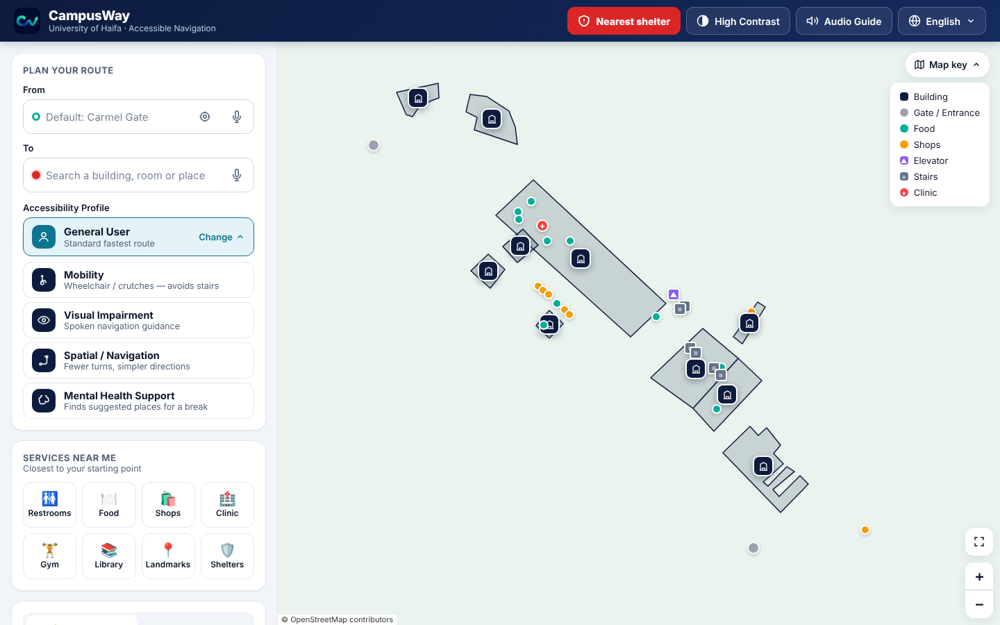
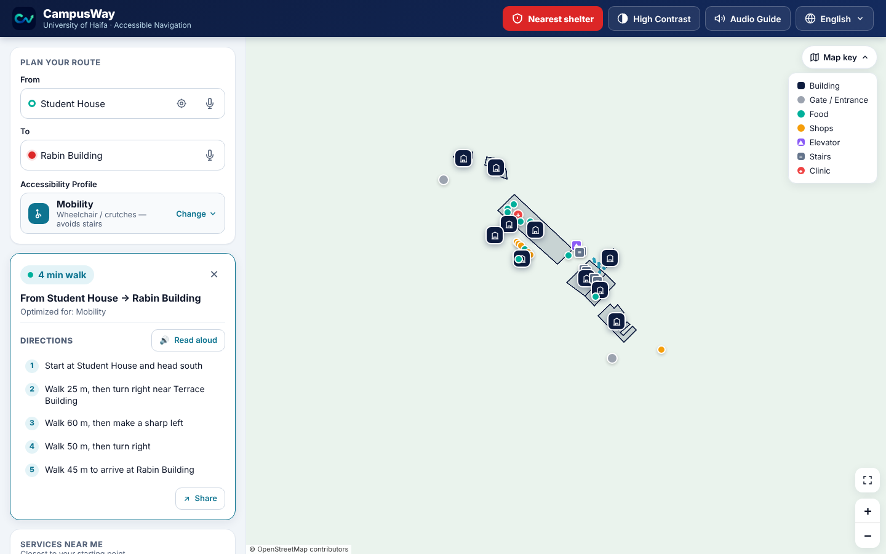
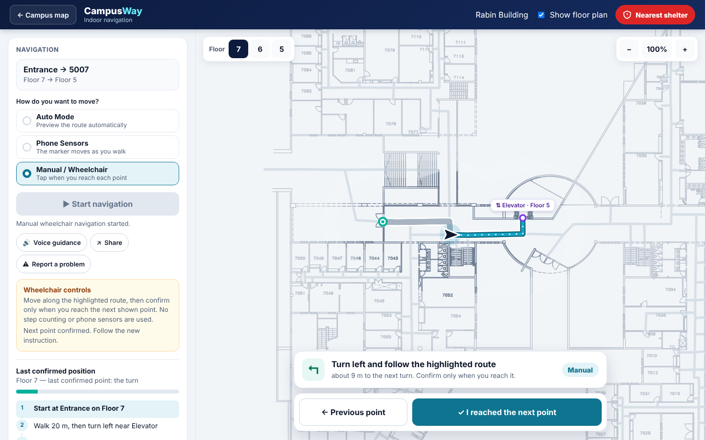
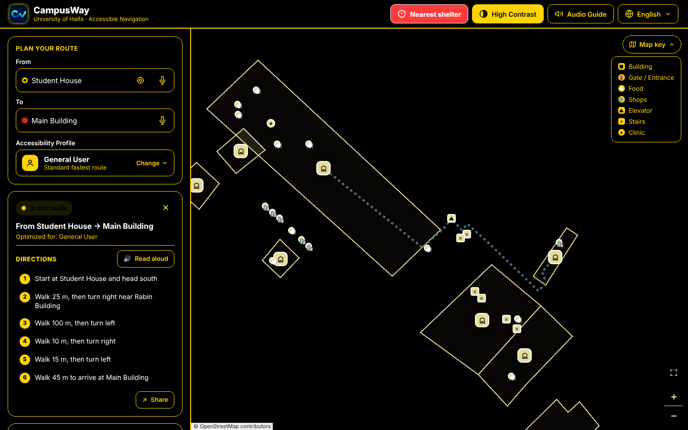

# 12 · Accessibility

> Accessibility is CampusWay's core purpose. This document describes the accessibility profiles, the inclusive-design features of the interface, how step-free routing is kept safe, and the current limits.

**Contents:** [Principles](#1-principles) · [Accessibility profiles](#2-accessibility-profiles) · [Step-free routing in detail](#3-step-free-routing-in-detail) · [Interface accessibility](#4-interface-accessibility) · [Languages and right-to-left](#5-languages-and-right-to-left) · [Limits](#6-limits)

---

## 1. Principles

1. **Honesty over convenience.** If no step-free route is mapped, CampusWay says so; it never draws a route that might contain stairs for a wheelchair user.
2. **More than one way to do everything.** Touch, keyboard, voice input, and spoken output.
3. **Different needs, different routes.** Profiles change the route itself, not just the colours.
4. **No sensor dependency for critical use.** Manual / Wheelchair mode works without any sensors.
5. **Language is accessibility.** Hebrew and Arabic speakers get a full right-to-left interface and spoken guidance in their language.

## 2. Accessibility profiles

| Profile | Who it is for | Outdoor routing | Indoor routing | Guidance |
|---|---|---|---|---|
| General User | Everyone | Fastest weighted route | Shortest route | Standard |
| **Mobility** | Wheelchair, crutches, walker, stroller | No steps; step-free entrances only; 0.8 m/s walking estimate | Elevators only; Manual / Wheelchair mode, locked step-free | Checkpoint confirmations |
| **Visual Impairment** | Blind and low-vision users | Standard | Standard | Audio guide on; voice guidance on indoors; read-aloud directions |
| **Spatial / Navigation** | People who find complex routes hard (e.g. spatial or cognitive difficulties) | Fewer turns (35° turns cost 6 m) | Fewer turns | Simpler, checkpoint-based indoor instructions |
| **Mental Health Support** | People who need a quiet break or feel overwhelmed | Standard | Standard | Landmarks button becomes Rest Spaces and moves first, with the 3 nearest suggestions and travel times |

The profile is kept for the browser session and passed to the indoor page.

## 3. Step-free routing in detail

| Layer | What is excluded |
|---|---|
| Outdoor paths | All `steps` edges (OpenStreetMap and hand-mapped stairs) |
| Building entrances | Entrances marked `requiresStairs` or `avoidForMobility` |
| Indoor graph | Every stairs node and every stair link between floors |
| Building transfers | Rabin ↔ Terrace always uses the shared elevator |
| Live status | Elevators reported out of service (official file or user reports) |

When the filtered graph has no path, the user sees *"No step-free outdoor route found"* or *"No step-free route found"*, and the ETA shows "—". Automated tests check that no fallback line is drawn in this case.

| Mobility route (stairs avoided) | Manual / Wheelchair indoor mode |
|---|---|
|  |  |

## 4. Interface accessibility

| Feature | Details |
|---|---|
| High-contrast mode | Black and yellow (#FFD400) theme; map markers redrawn with high-contrast symbols |
| Touch targets | Main controls are at least 44 × 44 px; a few secondary buttons (close ✕, *Read aloud*, *Share*) are 30–36 px |
| Keyboard | Controls are standard buttons and inputs, so they can be reached with Tab; suggestion lists use the arrow keys, Enter and Escape; the language menu supports the arrow keys and Escape; indoor steps can be read with Enter or Space |
| Focus | Visible focus ring (design token) |
| ARIA | Combobox/listbox pattern for search, `aria-pressed` on mode buttons, `role="status"` / live regions for route status and messages, labelled icon buttons |
| Dialogs | Native `<dialog>` with focus handling for share, report and arrival |
| Reduced motion | The indoor route animation and the voice meter respect `prefers-reduced-motion` (the outdoor route dash still animates) |
| Spoken output | Audio guide, *Read aloud* directions, indoor voice guidance; each step can be read on its own |
| Voice input | Speech recognition for the start and destination fields |
| Readable text | System font stack, clear hierarchy, plain-language instructions with distances and landmarks |
| Non-colour cues | Icons and text labels together with colour (e.g. elevator ▲ / ✕, legend entries) |

## 5. Languages and right-to-left

- English, Hebrew and Arabic for every screen, direction and spoken message.
- `<html dir="rtl">` with CSS logical properties, so the layout mirrors cleanly. Route arrows flip (→ / ←).
- Search understands all three languages and their letter variants (Hebrew final letters and niqqud, Arabic diacritics and letter forms).
- Speech uses `he-IL`, `ar-SA` / `ar` and `en-US` voices when the device has them.

## 6. Limits

- Accessibility depends on how complete and accurate the mapping is. A calculated route does not check current conditions (construction, crowds, a broken door) unless they are entered in the status file or reported.
- Some areas have no step-free connection mapped, e.g. Terrace Building floors 0 and −1 have no mapped elevator.
- Phone Sensors mode is an estimate. It does not detect leaving the route, and it is not recommended for wheelchair use (Manual mode is used instead).
- The settings for high contrast and the audio guide are not remembered after a reload. With the Visual profile, the audio guide is switched on when the profile is chosen, but not again after a reload or when returning from the indoor page.
- In Arabic, building and place names are shown in Hebrew, because the data has no Arabic names yet.
- A few status messages are still English only.
- A full screen-reader audit with TalkBack and VoiceOver is recommended (see [14 · Limitations and future work](14-limitations-and-future-work.md)).
