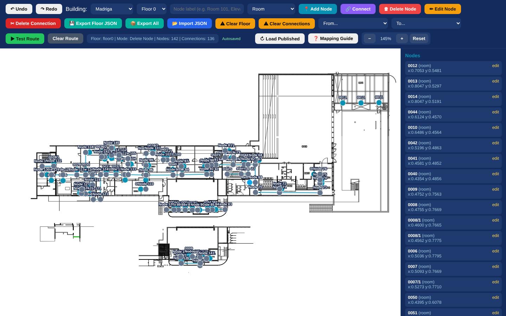
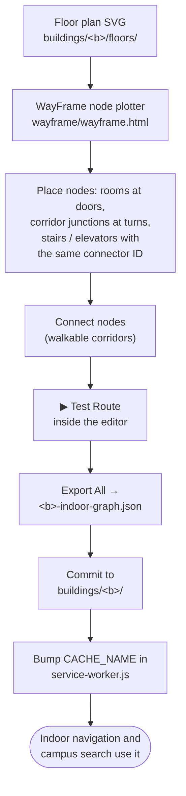

# 13 · Developer tools and indoor mapping

> The tools in the project for building and checking map data and testing device features, and step-by-step guides for mapping a building, adding an entrance or a place, and debugging routes.

**Contents:** [Tools overview](#1-tools-overview) · [WayFrame node plotter](#2-wayframe-node-plotter) · [Mapping a building step by step](#3-mapping-a-building-step-by-step) · [Adding entrances and places](#4-adding-entrances-and-places) · [Route tester](#5-route-tester) · [Device test pages](#6-device-test-pages) · [Debugging the campus map](#7-debugging-the-campus-map) · [Useful indoor deep links](#8-useful-indoor-deep-links)

---

## 1. Tools overview

None of these pages is linked from the app; open them by URL (e.g. `http://localhost:8080/wayframe/wayframe.html`).

| Page | Purpose |
|---|---|
| `wayframe/wayframe.html` | **WayFrame node plotter**: draw and edit indoor graphs over floor plans |
| `wayframe/route-tester.html` | View a published graph and test a route over the raw floor plan |
| `wayframe/sensor-test.html` | Field test for step detection and heading |
| `wayframe/audio-test.html` | Text-to-speech voice availability per language |
| `wayframe/mic-test.html` | Microphone permission and level meter |
| `index.html?debug` | Click the map to get coordinates |

## 2. WayFrame node plotter



| Control | Function |
|---|---|
| Building / Floor | Choose the building and floor; the floor plan loads as the background |
| Node label + type | Label (e.g. `Room 101`) and type (room, corridor, stairs, elevator, entrance, restroom, landmark, shelter, food, parking, library, museum, clinic, gym) |
| **Add Node** | Click on the plan to place a node; its position is saved in normalised 0–1 coordinates |
| **Connect** | Click two nodes to add a walkable connection |
| **Delete Node / Edit Node / Delete Connection** | Edit the graph |
| Undo / Redo | Up to 50 steps |
| Clear Floor / Clear Connections | Reset the current floor |
| From / To + **Test Route** | Run a cross-floor route inside the editor (drawn in green) |
| **Load Published** | Load the graph currently in the repository (`buildings/<b>/…-indoor-graph.json`) |
| **Export Floor JSON / Export All** | Download the graph file to commit |
| **Import JSON** | Load a graph file |
| **Mapping Guide** | Built-in mapping rules |
| Zoom (wheel, + / − / 0) and drag | Navigate the plan |

Work is autosaved in the browser's `localStorage` for each building. **Load Published** first, so you do not overwrite newer work with an old autosave.

## 3. Mapping a building step by step



<sub>Diagram source: [`diagrams/12-mapping-workflow.mmd`](diagrams/12-mapping-workflow.mmd) · Image: [PNG](diagrams/12-mapping-workflow.png) · [SVG](diagrams/12-mapping-workflow.svg)</sub>

1. **Add the floor plans.** Put one SVG per floor in `buildings/<key>/floors/` (`floor0.svg`, `floor1.svg`, `floorminus1.svg` …). Keep the same crop for every floor where possible.
2. **Open WayFrame**, choose the building and the floor, and press **Load Published** if a graph already exists.
3. **Place nodes:**
   - **rooms** at their **doors**, labelled with the room number shown on signs;
   - **corridor** nodes at every junction and bend, so that straight lines between them stay inside the corridors;
   - **entrance** nodes at building doors; these are the IDs used in `BUILDING_ENTRANCES`;
   - **stairs** and **elevator** nodes at each landing, with the **same connector ID on every floor** (e.g. `elevator1`), so the floors link up;
   - services: restroom, shelter, food, library and so on.
4. **Connect** neighbouring nodes along walkable corridors only. Do not connect through walls.
5. **Test Route** between distant rooms and across floors; fix gaps.
6. **Export All** and save the file as `buildings/<key>/<key>-indoor-graph.json`.
7. If the building is new, also:
   - add its entrances to `BUILDING_ENTRANCES` in `app/prototype/data.js`;
   - add the graph and floor plans to `APP_FILES` in `service-worker.js`;
   - add the building to the lists in `index.html` and `navigation-demo.html` (search graphs, floor order, building names).
8. **Bump `CACHE_NAME`**, run the tests, and check the route in the app.

**Quality checks before committing:**

- [ ] Every room is connected (no isolated nodes).
- [ ] Every stairs and elevator node has a connector ID, and the same ID exists on each floor it serves.
- [ ] Every floor that should be step-free is reachable by an elevator.
- [ ] Labels are real room numbers or names, not "Node 123".
- [ ] If the building has a JS copy (`madriga-graph.js`, `multi-purpose-graph.js`), update it too.

## 4. Adding entrances and places

**Entrance** (`app/prototype/data.js` → `BUILDING_ENTRANCES`):

```js
rabin: [
  // Rabin Floor 7 — Main ↔ Rabin bridge entrance
  { nodeId: 'floor7_n108', lat: 32.7614978735074, lng: 35.02023115754128 },
  // Rabin Floor 6 entrance → plaza
  { nodeId: 'floor6_n73', lat: 32.76125427364507, lng: 35.020638853311546 },
  { nodeId: 'floor5_n162', lat: 32.76116743464413, lng: 35.02082761377097 },
  { nodeId: 'floor7_n109', lat: 32.761074, lng: 35.020066, requiresStairs: true }
]
```

- `nodeId` should be the `entrance` node in the building's graph.
- `lat`/`lng` should sit on, or very close to, an outdoor path. Check with `?debug`.
- Mark entrances that need stairs with `requiresStairs: true`, so the Mobility profile skips them. Use `primary: true` for the default entrance.

**Food place or shop** (`CAMPUS_DATA.points.food` / `.shops`): add `{name, lat, lng, type}` and, if it is inside a mapped building, `indoor: {buildingKey, nodeIds: [...]}`. Add the Hebrew name to `PLACE_NAMES_HE`.

**Outdoor path fix** (`app/prototype/outdoor-routing.js` → `applyCampusCorrections()`): add a node with `addCampusNode('campus_<name>', lat, lng)` **before** any `addEdge` that uses it, then `addEdge(a, b, 'footway' | 'steps' | …)`. An edge whose end node does not exist yet is skipped without a warning.

## 5. Route tester

`wayframe/route-tester.html` loads a published graph, lets you pick start and end nodes, and draws the route over the raw floor plan with a text step list. It uses its own simplified routing (no step-free option), so treat it as a data viewer. The app's real routing is in `navigation-demo.html`.

## 6. Device test pages

| Page | How to use it |
|---|---|
| **Sensor test** | Open on a phone over HTTPS → *Enable Sensors*. Watch heading, filtered acceleration and step counts. Tests: walk 20 steps (the count should be about 20); walk slowly with pauses; stand still (nothing should be added); *Set forward direction*, walk 5 steps forward and 3 back (net about 2). |
| **Audio test** | Turn audio on, pick EN/HE/AR, and play instructions, a floor change, a warning and arrival. Lists the installed voices per language (on-device or online). |
| **Mic test** | Checks secure context, microphone permission and input level. Nothing is recorded. |

## 7. Debugging the campus map

| Technique | How |
|---|---|
| Coordinates | Open `index.html?debug` and click the map |
| Outdoor graph overlay | In the browser console: `showOutdoorDebugGraph()` |
| Simulate status | Edit `app/data/campus-status.json`, or intercept it in DevTools; e.g. an outage for `{"building":"campus","elevator":"main-600-outdoor"}` |
| Fresh state | DevTools → Application → *Clear site data* (removes caches, favourites and storage) |
| Sensor emulation | DevTools → More tools → *Sensors* (orientation); motion events can be dispatched from the console |

## 8. Useful indoor deep links

| Link (relative to the site root) | Shows |
|---|---|
| `wayframe/navigation-demo.html?building=rabin&from=floor7_n108&to=floor5_n0` | Rabin entrance (floor 7) → room 5007 (floor 5), multi-floor |
| `wayframe/navigation-demo.html?building=education&from=floor3_n40&to=floor2_n0` | Education entrance (floor 3) → room 201, elevator |
| `wayframe/navigation-demo.html?building=main&from=floor700_n69&to=floor600_n60` | Main entrance 700 → Hecht Museum |
| `wayframe/navigation-demo.html?building=student&from=floor1_n105&to=floor3_n0` | Student House → room 301 |
| `index.html?from=room:main:floor500_n0&to=room:madriga:floor1_n6` | Room 521 (Main) → Room 1001 (Terrace), full journey |
